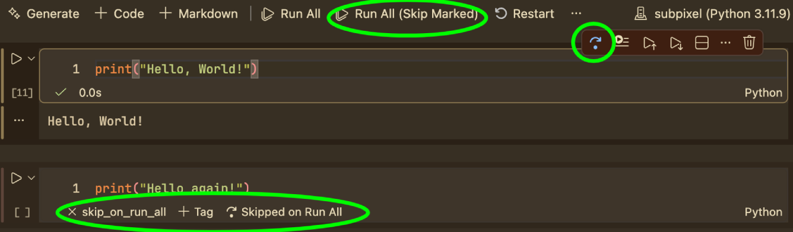

# Notebook Cell Skip

Mark Jupyter notebook cells to be **skipped during "Run All"** while keeping them individually executable.

Perfect for cells containing one-time setup, debugging snippets, or exploratory code that shouldn't run as part of your full notebook pipeline.

## Features

### Toggle Skip
Click the skip icon in any code cell's toolbar to mark it. Marked cells display a **"Skipped on Run All"** indicator.

### Run All (Skip Marked)
Use the toolbar button to run all cells except those marked as skipped. Or run all of the cell including those you marked.

### Add Skip Cell
Insert a new pre-marked skip cell from the cell insert toolbar between cells.

## How It Works

- The skip flag is stored as a standard **Jupyter cell tag** (`skip_on_run_all`), so it persists across saves, reopens, and version control.
- No dependency on specific Jupyter extension versions — uses only stable VS Code Notebook APIs.
- Running a skipped cell individually works exactly as normal. The skip only applies to the "Run All (Skip Marked)" command.

## License

MIT
